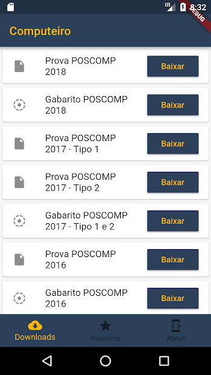
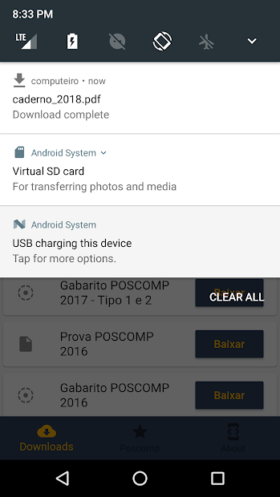
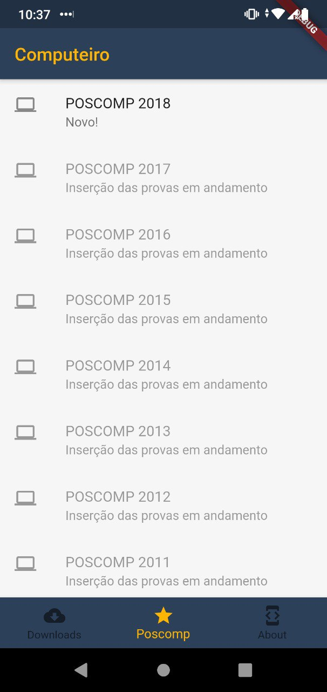
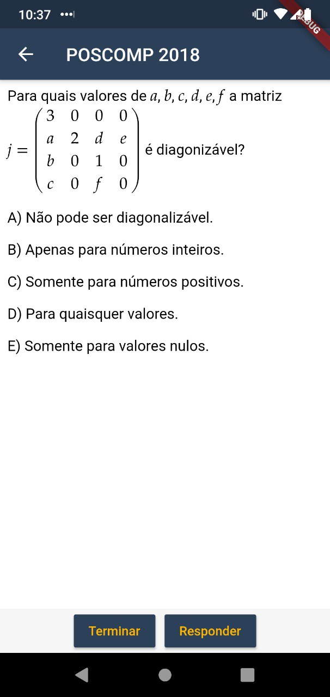
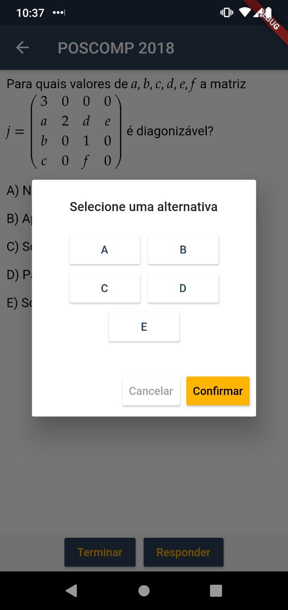

<h1> Computeiro </h1>

    
    <!--  -->
    
> Computer science exams in your pocket. Built with Flutter.

  <a href="#the-app">The App</a> •
  <a href="#contributing">Contributing</a> •
  <a href="#license">License</a>

## The app

### Download historical exams and responses

### Make the test

## Contributing

Contributions are welcome!
However, if it's going to be a major change, please create an issue first.
Before starting to work on something, please comment on a specific issue and say you'd like to work on it.

## License

[MIT](https://tldrlegal.com/license/mit-license)

<!-- ## Support -->
