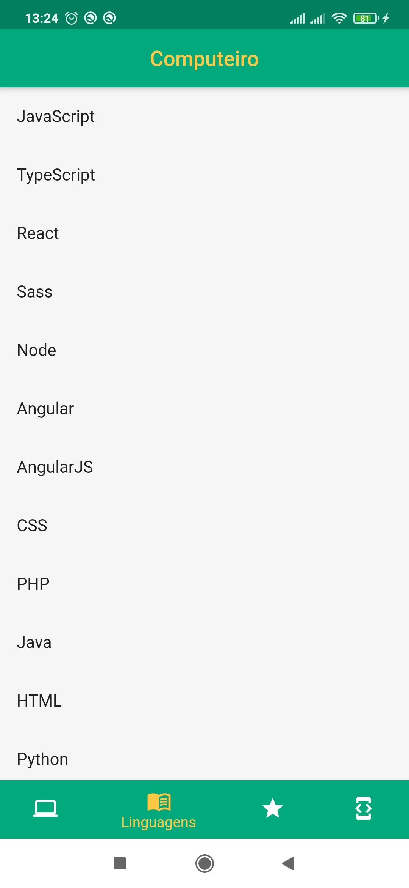
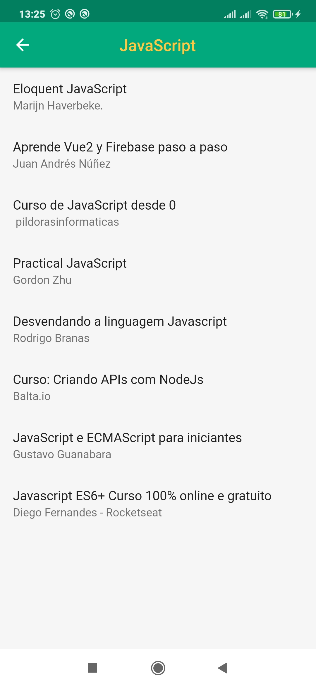
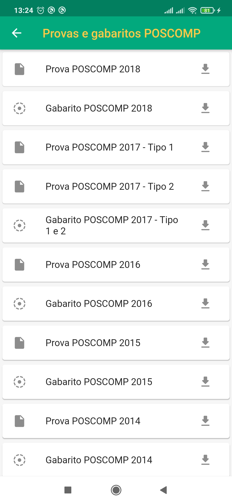
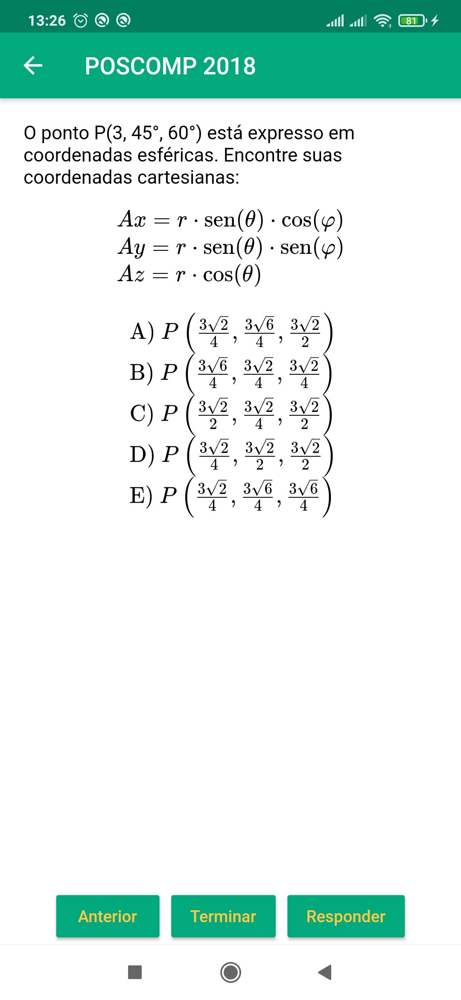

<h1> Computeiro - Free courses, books and exams</h1>

    
    <!--  -->
    
> Computer science exams in your pocket. Built with Flutter.

    <a href="#free-courses">Free Courses</a> •
  <a href="#contributing">Contributing ❤️</a> •
  <a href="#license">License</a>

This project aims to provide free resources for anyone who needs to study subjects of computer science, this includes theoretical and practical courses, books and others.

This project also includes an interactive exam of POSCOMP (an traditional computer science exam in Brazil).

### Free Courses

It's possible to check free courses and books on the app

### POSCOMP exams and responses

It's possible to download all the historical original exams and responses of POSCOMP exams

### Make the POSCOMP test

By using the [flutter tex library](https://github.com/shah-xad/flutter_tex) we provide an awesome visualization of each question during the exam.

## Contributing

If you liked this project, give a star ⭐

Review the app on Google Play 🚀

Contributions are welcome! 💓

## License

[MIT](https://tldrlegal.com/license/mit-license)

<!-- ## Support -->
